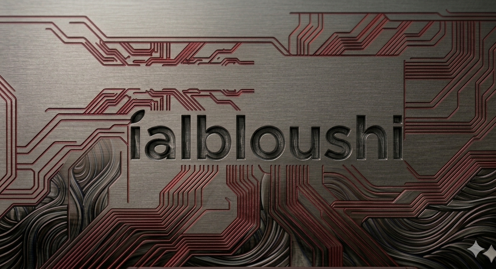
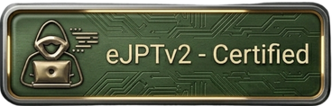
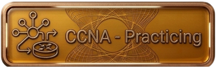
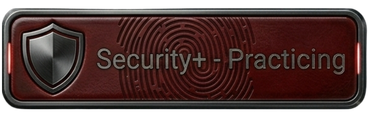
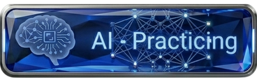

  

  &nbsp;&nbsp;
  
  &nbsp;&nbsp;&nbsp;
  
  &nbsp;&nbsp;&nbsp;
  
  &nbsp;&nbsp;&nbsp;
  
  &nbsp;&nbsp;

  <b>Cybersecurity Enthusiast &nbsp;|&nbsp; eJPTv2 Certified &nbsp;|&nbsp; Knowledge in CCNA, Security+, AI</b>

---

### 🧠 About Me

I am **eJPTv2 certified** and have actively gained knowledge in **CCNA, Security+, and AI**.  
I love learning every day and exploring new skills, because I believe that **knowledge is the key to building a better future**.  
I approach my goals with curiosity, dedication, and passion, and I focus on turning what I learn into practical experience and meaningful projects.

---

### 🛠 Skills & Tools

- Penetration Testing Basics (eJPTv2)
- Networking Fundamentals (CCNA knowledge)
- Security Fundamentals (Security+ knowledge)
- Python / Bash scripting
- AI Concepts

---

### 🎯 Goals

- Expand my networking and cybersecurity expertise
- Apply my knowledge to real-world challenges
- Keep learning, growing, and building projects that matter

---

### 🌐 Connect With Me

  
  &nbsp;
  

---

  <i>"Every day I learn, grow, and move a little closer to my goals."</i>

