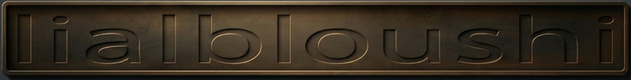

  

  

  <b>Cybersecurity Enthusiast &nbsp;|&nbsp; eJPTv2 Certified &nbsp;|&nbsp; ICCA Certified &nbsp;|&nbsp; SOC Analyst Track</b>

---

### 🧠 About Me

I am a **Cybersecurity enthusiast** with hands-on experience in labs and practical environments.

I hold **eJPTv2** and **ICCA certifications**, and I am currently focusing on **SOC operations, threat detection, and blue team practices**.

I have completed CCNA training at a networking institute, where I gained hands-on experience configuring and working with routers and switches. This practical experience helped me build a strong foundation in networking, and I continue to improve my skills through continuous learning and practice.

My goal is to apply my knowledge in real-world environments and grow as a **Security Analyst**.

---

### 🛠 Skills & Tools

- Security Monitoring & Alert Analysis  
- Incident Response Fundamentals  
- Networking Basics (CCNA Training)  
- Penetration Testing Fundamentals (eJPTv2)  
- Python & Bash (Basic)  
- Blue Team Fundamentals  

---

### 📜 Certifications

- eJPTv2 – INE  
- ICCA – INE  

---

### 🎯 Current Focus

- SOC Operations  
- SIEM & Log Analysis  
- Threat Detection  

---

### 🌐 Connect With Me

  
  &nbsp;
  

---

  

---

  <i>"Focused on learning, building, and becoming a better security professional every day."</i>

